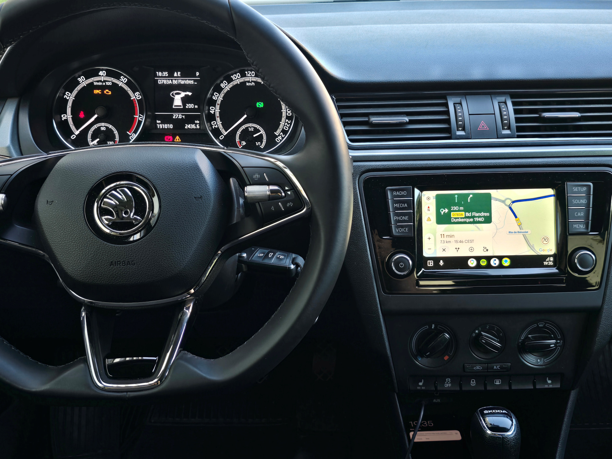
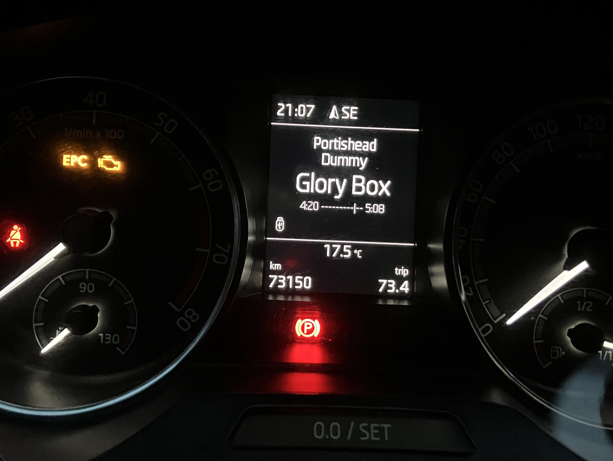
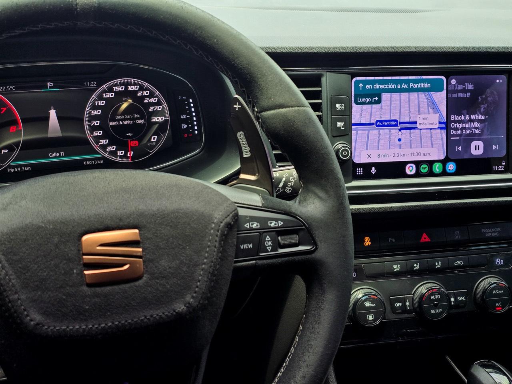
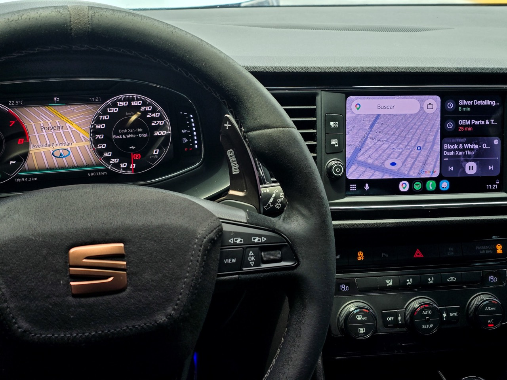
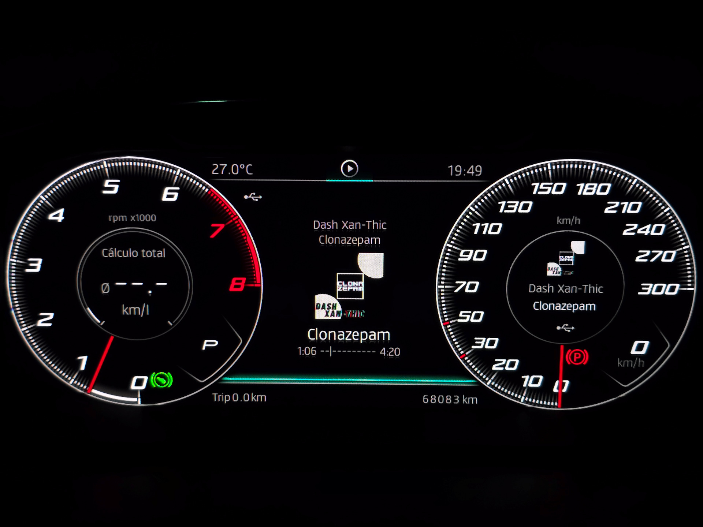
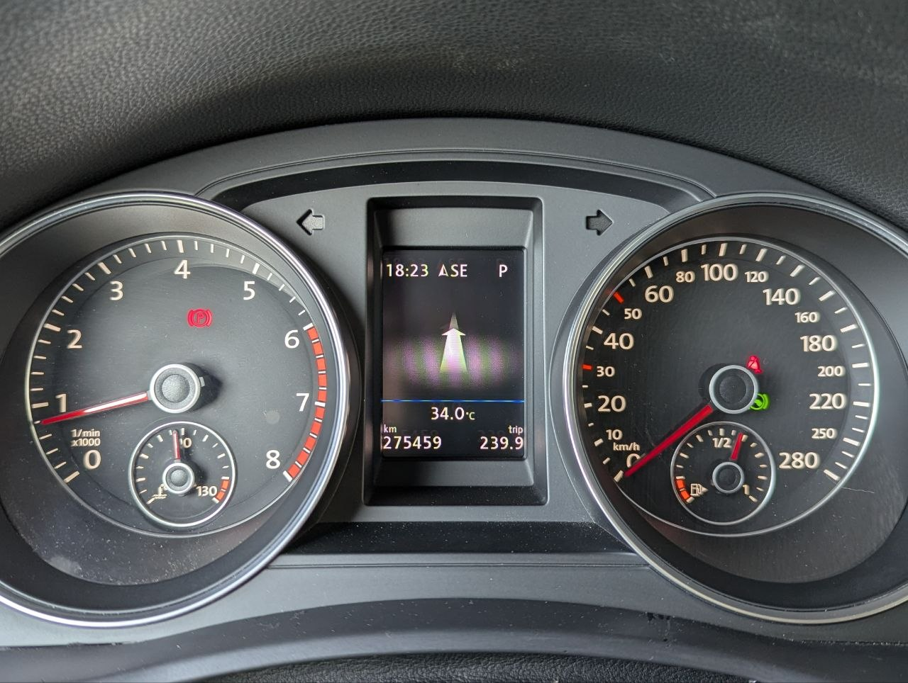
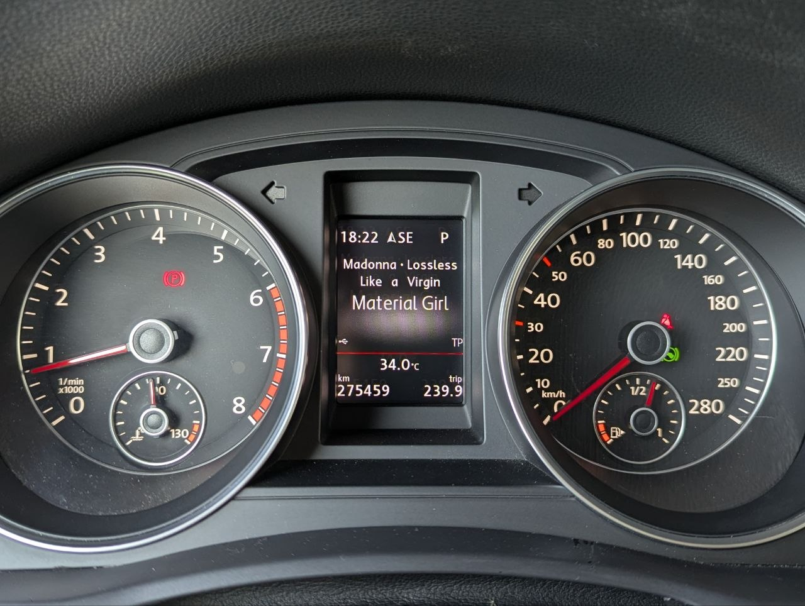

# Kombibridge — Android Auto navigation on the MIB2 STD2 instrument cluster

Show Android Auto turn-by-turn navigation (and player info) on the
instrument cluster of a **VW MIB2 STD2 / MST2** unit (TechniSat / Preh).

<p align="center">
  
  <br>
  <em>MIB2 <strong>with</strong> navigation (Amundsen): AA guidance driving the cluster's real Navigation menu.</em>
</p>

Stock MIB2 STD2 cannot do this: the firmware deliberately leaves the Android Auto
navigation bridge disabled, and the cluster is not coded for navigation. Kombibridge adds the
missing pieces — without reflashing the firmware and **fully reversible**.

Both instrument-cluster stacks are now supported — the **MQB** (`mqbab2`) and the **PQ** (`mqbpq`)
BAP cluster variants — so the same build works whether your cluster speaks the MQB or the older PQ
protocol.

> **Status:** working (navigation in the cluster's media widget, or the real Navigation menu on a
> nav-capable cluster, + real now-playing track).
> Personal/educational modding project. Use COMPLETELY at your own risk.

## ☕ Support this project

Kombibridge is a free, open-source hobby project. If you enjoy it and you'd like to say thanks, a
small crypto tip is very welcome.

> **Always double-check the network** before sending — funds sent on the wrong chain are lost.

| Coin | Network | Address |
|------|---------|---------|
| **USDT** | TRC-20 (Tron) | `TRypSugQAVagpSMHizwehC1CRmhCKqfLoR` |
| **BTC** | Bitcoin (native) | `bc1q0fv8uhr0tuvahk2dtdq357mnykg02067nq4k9x` |

Prefer to scan? Open one QR at a time:

<details>
<summary>📷 USDT (TRC-20) QR</summary>
<br>

</details>

<details>
<summary>📷 BTC QR</summary>
<br>

</details>

Thank you! ⭐ Starring the repo helps just as much.

## Demo

<p align="center">
  
  <br>
  <em>On a unit <strong>without</strong> navigation (Bolero): AA turn-by-turn injected into the cluster's media now-playing widget.</em>
</p>

<p align="center">
  
  <br>
  <em><strong>Media mode:</strong> the real now-playing track (artist / album / title) with an ASCII progress bar, shown when no route guidance is active.</em>
</p>

### SEAT Virtual Cluster (Digital Cockpit)

<p align="center">
  
  
  <br>
  <em>SEAT with the full <strong>Digital Cockpit</strong> (Virtual Cluster). <strong>Left:</strong> Android Auto
  turn-by-turn on the cluster during AA guidance. <strong>Right:</strong> with AA navigation off and the car's
  own (native) navigation active, Kombibridge shows the now-playing track on the cluster.</em>
</p>

<p align="center">
  
  <br>
  <em><strong>Cover art</strong> (<code>SHOW_COVER_ART</code>, AID / colour Virtual Cockpit only): the Android Auto
  album cover pushed to the cluster alongside the now-playing track and progress bar.</em>
</p>

### Older PQ cluster (mono centre display)

<p align="center">
  
  
  <br>
  <em>The older <strong>PQ</strong> cluster (small monochrome centre display between analogue gauges),
  with both output paths working independently.
  <strong>Left:</strong> Android Auto turn-by-turn maneuver via the navigation path.
  <strong>Right:</strong> the real now-playing track (artist / album / title) via the media path.</em>
</p>

---

## How it works

```
 Android Auto (phone)
      │  turn-by-turn + now-playing live inside Google's libext.google.gal.receiver.so,
      │  but the stock SAL never registers those endpoints
      ▼
 ┌─ shim/ ── patched libgal ───────────────────────────────┐
 │ registers Google's Navigation + MediaPlaybackStatus      │
 │ endpoints itself; writes maneuver/road/distance +        │
 │ track Title/Artist/Album to /dev/shmem/aa_nav + aa_media  │
 └──────────────────────────────────────────────────────────┘
      ▼
 ┌─ jar/ ── HMI Java mod (-Xbootclasspath/p) ───────────────┐
 │ reads the shmem files and renders them: on a non-nav      │
 │ cluster into the media now-playing widget, on a           │
 │ nav-capable one into the real navsd Navigation menu       │
 │ (picked at runtime by ClusterCaps.isNavCapable())         │
 └──────────────────────────────────────────────────────────┘
      ▼
 Instrument cluster shows the live maneuver / track
```

Two firmware facts make this possible — the AA nav/media data is present in the GAL library but
never registered by the stock SAL, and the cluster's media widget is drawable while its nav slot
stays gated on a non-nav unit. Full write-up with the binary evidence:
**[`docs/ARCHITECTURE.md`](docs/ARCHITECTURE.md)**; the nav-capable path:
**[`docs/NAVIGATION_VIA_NAVSD.md`](docs/NAVIGATION_VIA_NAVSD.md)**.

---

## Repository layout

```
jar/      HMI Java mod  → builds AAtoKombi.jar
  src/        our sources (incl. faithful shadows of several stock classes: the audio + AA targets
              and the navsd nav functions)
  build.sh    one-command build (javac + jar)
  lib/        ← MIBHMI.jar (staged here by build.sh from the MIBHMI.jxe)

shim/     native libgal patch → builds the patched .so   (files + RE specs: shim/README.md)
  build.sh    compile + link + inject
  lib/        ← put unit's libext.google.gal.receiver.so here

docs/     ARCHITECTURE.md          — the design + notes
          NAVIGATION_VIA_NAVSD.md  — the nav-capable (navsd Navigation-menu) output path

build.sh          one-button build of BOTH artifacts from the toolbox dumps (all in Docker)
docker/           the build toolchain image (JDK 8 + clang + lld + pyelftools)
tools/            optional firmware-extraction / shadow-verification helpers
```

The on-device **deployment** (SD card, Green Engineering Menu, activate/deactivate scripts)
lives in a separate toolbox repository —
[kkrvch/mib-std2-pq-zr-toolbox](https://github.com/kkrvch/mib-std2-pq-zr-toolbox) — this repo
only builds the two artifacts.

---

## Patch the unit (step by step)

You build the two artifacts **against the exact files from your own unit**, then deploy them back
with the toolbox. Nothing here is firmware-version-specific — the shim auto-adapts across STD2
firmware builds. (Development was done on **`MST2_EU_SK_ZR_P0480T`**.)

> For a pure **FTP + Telnet** install/build/rollback flow, follow
> [`docs/INSTALL_FTP_TELNET.md`](docs/INSTALL_FTP_TELNET.md) instead (Still requires toolbox to enable FTP/Telnet).

### 0. Prerequisites (once)
- **The deployment toolbox** ([kkrvch/mib-std2-pq-zr-toolbox](https://github.com/kkrvch/mib-std2-pq-zr-toolbox)) set up for your unit.
- **Docker** — the whole build runs in containers (jxe2jar + the JDK 8 / clang / lld / pyelftools
  toolchain), so nothing else needs installing.

### 1. Pull the two files off the unit (with the toolbox)
Use the toolbox's **"Dump files"** menu item to copy these from the unit to your computer:
- **`MIBHMI.jxe`** — the HMI executable (from `/tsd/hmi/ifs/`). `build.sh` turns it into the HMI
  compile classpath (`MIBHMI.jar`) for you, inside Docker.
- **`libext.google.gal.receiver.so`** — the stock GAL library (from `/tsd/lib/sal/gal/`). This is
  the file we patch, so it **must be the copy from the unit** (different firmware builds differ —
  that's exactly what the shim's auto-resolve handles).

> Keep an untouched backup of the original `libext.google.gal.receiver.so` — the toolbox's
> Disable step restores it, but a manual backup is cheap insurance.

### 2. Build both artifacts
```sh
./build.sh /path/to/your/MIBHMI.jxe /path/to/your/libext.google.gal.receiver.so
# -> dist/AAtoKombi.jar                  (the HMI mod)
# -> dist/libext.google.gal.receiver.so  (the patched libgal)
```
Everything runs in Docker: it converts the `.jxe` to a jar, builds the toolchain image (cached
after the first run), compiles both artifacts inside the container with the repo bind-mounted, and
drops the two deployables in `dist/`. It adapts to your firmware automatically (the libgal patch
resolves its per-build addresses from the file you pass, and the jar is rebuilt against your unit's
`MIBHMI.jar`).

### 3. Deploy both artifacts back to the unit (with the toolbox)
Put the two `dist/` outputs onto the toolbox SD card, then run the toolbox's Enable step:
- copy `dist/AAtoKombi.jar` to the SD `custom/java/` folder,
- copy `dist/libext.google.gal.receiver.so` to the SD `custom/sal/...gal/` folder.

The Enable step then installs the jar onto the HMI `-Xbootclasspath/p` (in `runHMI.sh`) and swaps in
the patched libgal (keeping a backup of the original).

It's **fully reversible** — the toolbox's Disable removes the jar from the bootclasspath and
restores the original libgal. Nothing is written to flash by the mod itself (the captured data
goes through `/dev/shmem`, a RAM filesystem).

### 4. Verify on the unit
- Connect your phone over Android Auto and start navigation → the cluster's media tab shows the
  maneuver + street; play music with no active route → it shows the real Title/Artist/Album.
- If something's off, check that `/dev/shmem/aa_nav` and `/dev/shmem/aa_media` exist and advance
  while the phone is connected (the patched libgal writes them) and the `MIBLogger` output for
  `AANavReader` / `ShmemMediaReader` lines.

### Options
The defaults just work. All build-time switches live in one file —
`jar/src/de/aatokombi/Config.java`; flip a constant and rebuild the jar:
- `SHOW_NAV` — draw AA turn-by-turn on the cluster (the navsd **Navigation** menu on a nav-capable
  cluster, the media widget on a non-nav one). Default on.
- `SHOW_MEDIA` — show the real now-playing track in the media widget when not navigating. Default on.
- `SHOW_MEDIA_PROGRESS` — add an ASCII playback progress bar to the now-playing track. Default off.
- `SHOW_COVER_ART` — push the AA album cover to the cluster (AID / colour Virtual Cockpit only; inert
  on a monochrome cluster). Requires `SHOW_MEDIA`. Default off.
- `SUPPRESS_NAV_ACTIVE_PLACEHOLDER` — hide the stock *"Navigation on the mobile device is active"*
  cluster placeholder. Default on.
- `PROBE_ENABLED` — diagnostic cluster-layout probe; keep off for normal builds.
- `LOG_LEVEL` — log verbosity (`TRACE` … `SILENT`).

Deeper build notes: [`docs/`](docs/) and [`shim/README.md`](shim/README.md).

---

## Credits
Kombibridge is a port of **[adi961/mib2-android-auto-vc](https://github.com/adi961/mib2-android-auto-vc)**
(Android Auto navigation on the cluster for MIB2 **High** / MHI2) to MIB2 **STD2** / MST2. The HMI
side — the AA target handling, the navigation handler, and the `de.adi961.miblogger` logger — comes
from that project. adi961's mod in turn builds on the LSD/bootclasspath work of
[grajen3](https://github.com/grajen3/mib2-lsd-patching) and
[andrewleech](https://github.com/andrewleech). The STD2 shim and the media-widget approach are new
here.
